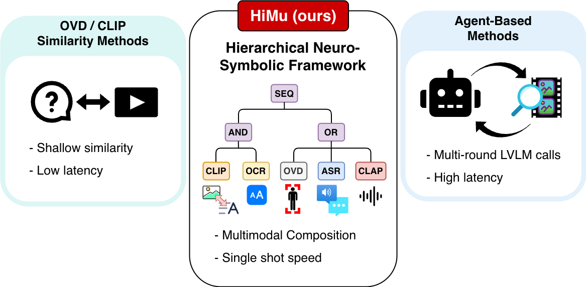
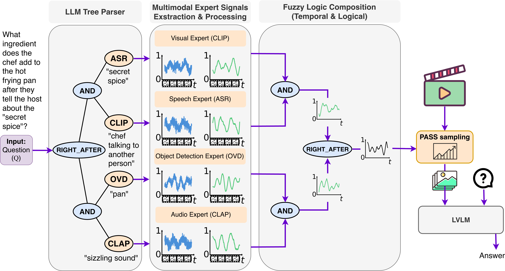
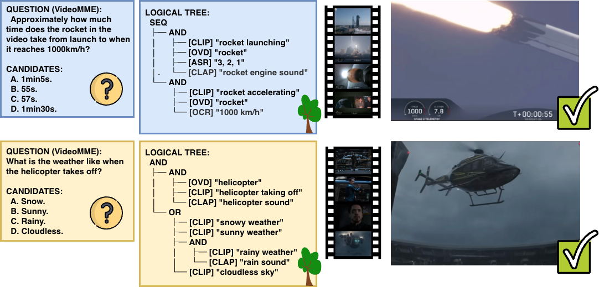

# HiMu: Hierarchical Multimodal Frame Selection

**Training-free, plug-and-play frame selection for long-form video question answering.**

HiMu selects the K most question-relevant frames from any video for your downstream Vision-Language Model (VLM). No fine-tuning required.


<p align="center">
  
</p>

## How It Works

HiMu is a 5-stage pipeline:

<p align="center">
  
</p>

1. **Query Parsing** - An LLM decomposes the question into a hierarchical logic tree. Leaf nodes are `(expert, query)` pairs; internal nodes are fuzzy operators (`AND`, `OR`, `SEQ`, `RIGHT_AFTER`).

2. **Expert Signal Extraction** - Five experts across two modalities ground atomic predicates into per-frame scores:

   | Expert | Modality | Backbone | Detects |
   |--------|----------|----------|---------|
   | CLIP | Visual | DFN5B ViT-H/14 | Scenes, actions, concepts |
   | YOLO | Visual | YOLO-World v2 | Objects, people |
   | OCR | Visual | docTR | On-screen text |
   | ASR | Audio | faster-whisper turbo | Speech content |
   | CLAP | Audio | LAION CLAP | Environmental sounds |

3. **Normalization + Smoothing** - Robust median/MAD normalization with sigmoid mapping, then modality-specific Gaussian smoothing (visual: 0.5s, speech: 1.5s, audio: 2.0s).

4. **Fuzzy Logic Composition** - Bottom-up tree evaluation with continuous operators:
   - `AND`: product t-norm
   - `OR`: probabilistic sum
   - `SEQ`: temporal ordering with backward/forward gates
   - `RIGHT_AFTER`: exponential decay for tight adjacency

5. **Frame Selection** - Select top-K frames from the resulting satisfaction curve.

### Example: Questions and Logic Trees

<p align="center">
  
</p>

## Installation

```bash
pip install himu              # core (requires OpenAI API key for tree parsing)
pip install "himu[all]"       # all expert backends
```

Install individual expert backends:

```bash
pip install "himu[clip]"      # CLIP (OpenCLIP)
pip install "himu[yolo]"      # YOLO-World (object detection)
pip install "himu[ocr]"       # docTR (on-screen text)
pip install "himu[asr]"       # faster-whisper (speech)
pip install "himu[clap]"      # CLAP (environmental audio)
```

## Running the Examples

The examples in `examples/` use a sample video from the [Video-MME](https://video-mme.github.io/) benchmark. Before running them, download the video:

```bash
python assets/videomme/download_video.py
```

This downloads a ~4 min YouTube video about space debris. The subtitle file and sample questions are already included.

## Quick Start

```python
from himu import HiMuSelector

selector = HiMuSelector()

result = selector.select_frames(
    video_path="video.mp4",
    question="What happens after the narrator mentions the chemical reaction?",
    num_frames=16,
)

print(result.frame_indices)   # [12, 14, 15, 17, ...]
print(result.best_timestamp)  # 14.0
print(result.truth_curve)     # per-frame satisfaction scores
```

### With MCQ Candidates

```python
result = selector.select_frames(
    video_path="video.mp4",
    question="What is the chef wearing?",
    candidates=["Blue apron", "Red jacket", "Green hat"],
    num_frames=16,
)
```

### With a VLM (GPT-4o example)

```python
import cv2, base64
from openai import OpenAI
from himu import HiMuSelector

selector = HiMuSelector()
result = selector.select_frames("video.mp4", question, num_frames=16)

# Extract selected frames
cap = cv2.VideoCapture("video.mp4")
fps = cap.get(cv2.CAP_PROP_FPS)
images = []
for idx in result.frame_indices:
    cap.set(cv2.CAP_PROP_POS_FRAMES, int(idx * fps / result.fps))
    ret, frame = cap.read()
    if ret:
        _, buf = cv2.imencode(".jpg", frame)
        images.append(base64.b64encode(buf).decode())
cap.release()

# Send to GPT-4o
client = OpenAI()
content = [{"type": "text", "text": question}]
for b64 in images:
    content.append({"type": "image_url", "image_url": {"url": f"data:image/jpeg;base64,{b64}"}})

response = client.chat.completions.create(
    model="gpt-4o",
    messages=[{"role": "user", "content": content}],
)
```

## Configuration

### Presets

```python
from himu import create_himu_selector

selector = create_himu_selector("default")       # all experts
selector = create_himu_selector("visual_only")   # no audio experts
selector = create_himu_selector("fast")          # CLIP-only, no smoothing
```

### Custom Configuration

```python
from himu import HiMuSelector, HiMuConfig
from himu.config import ExpertConfig, SmoothingConfig

config = HiMuConfig(
    fps=2.0,                                      # sample at 2 FPS
    clip_preset="dfn5b-clip",                     # CLIP model preset
    asr=ExpertConfig(enabled=False),              # disable ASR
    smoothing=SmoothingConfig(visual_sigma=1.0),  # wider visual smoothing
)

selector = HiMuSelector(config=config, device="cuda:0")
```

### LLM Backends

```python
from himu import HiMuSelector
from himu.llm import create_llm

# OpenAI (default)
llm = create_llm("openai", model="gpt-4o")

# Google Gemini
llm = create_llm("gemini", model="gemini-2.0-flash")

# Local Qwen3 (no API key needed)
llm = create_llm("qwen3", model="Qwen/Qwen3-8B", device="cuda:1")

selector = HiMuSelector(llm=llm)
```

### Feature Caching

Cache query-independent features for fast multi-query processing:

```python
selector = HiMuSelector(cache_dir="/tmp/himu_cache")

# Extract features once
selector.cache_features("video.mp4")

# Fast per-query selection (only YOLO re-runs)
for q in questions:
    result = selector.select_frames("video.mp4", q)
```

## API Reference

### `HiMuSelector`

```python
HiMuSelector(
    config: HiMuConfig = None,     # Pipeline configuration
    llm: BaseLLM = None,           # LLM for query parsing
    device: str = None,            # GPU device (default: "cuda")
    cache_dir: str = None,         # Feature cache directory
    verbose: bool = False,         # Detailed logging
)
```

### `select_frames()`

```python
result = selector.select_frames(
    video_path: str,               # Path to video file
    question: str,                 # Natural language question
    candidates: List[str] = None,  # MCQ answer options
    num_frames: int = 16,          # Number of frames to select
    fps: float = None,             # Frame rate (default: config.fps)
)
```

### `FrameSelectionResult`

| Field | Type | Description |
|-------|------|-------------|
| `frame_indices` | `np.ndarray` | Selected frame indices (sorted by score) |
| `timestamps` | `np.ndarray` | Timestamps of selected frames |
| `scores` | `np.ndarray` | Satisfaction scores of selected frames |
| `truth_curve` | `np.ndarray` | Per-frame satisfaction curve |
| `tree` | `dict` | Logic tree from LLM |
| `best_frame_idx` | `int` | Index of highest-scoring frame |
| `best_timestamp` | `float` | Timestamp of best frame |
| `best_score` | `float` | Score of best frame |
| `num_frames` | `int` | Total extracted frames |
| `fps` | `float` | Frame extraction rate |

## Requirements

- Python >= 3.10
- GPU with >= 8GB VRAM (for all experts)
- OpenAI API key (for default LLM tree parsing)

## Main Results

Accuracy on Video-MME, LongVideoBench_val, and HERBench-Lite. All methods select K=16 frames. HiMu is a plug-and-play enhancer — no model-specific tuning required.

| Model | Method | Short | Medium | Long | Overall | LVB_val | HERBench-Lite |
|-------|--------|-------|--------|------|---------|---------|---------------|
| Qwen3-VL-8B | Uniform | 76.34 | 66.31 | 55.58 | 66.36 | 55.74 | 41.70 |
| Qwen3-VL-8B | **HiMu** | **78.55** | **71.00** | **69.90** | **73.22** | **64.19** | **43.22** |
| | | | | | | | |
| LLaVA-OV-1.5-8B | Uniform | 72.26 | 62.33 | 54.85 | 63.55 | 54.33 | 35.75 |
| LLaVA-OV-1.5-8B | **HiMu** | 71.87 | **66.99** | **63.94** | **67.65** | **57.85** | **35.87** |
| | | | | | | | |
| InternVL-3.5-8B | Uniform | 75.41 | 67.39 | 56.55 | 66.63 | 59.23 | 38.30 |
| InternVL-3.5-8B | **HiMu** | **76.92** | **70.40** | **66.50** | **71.35** | **64.11** | **38.32** |
| | | | | | | | |
| Qwen2.5-VL-7B | Uniform | 72.49 | 61.01 | 53.82 | 62.57 | 54.58 | 34.05 |
| Qwen2.5-VL-7B | **HiMu** | **73.08** | **65.10** | **62.86** | **67.09** | **57.51** | **35.17** |
| | | | | | | | |
| Gemma-3-12B | Uniform | 73.31 | 60.29 | 55.83 | 62.99 | 47.59 | 31.20 |
| Gemma-3-12B | **HiMu** | 71.56 | **65.70** | **67.48** | **68.28** | **53.92** | **31.47** |
| | | | | | | | |
| Gemini-2.5-Flash* | Uniform | 78.43 | 67.11 | 61.22 | 68.95 | 56.33 | 37.27 |
| Gemini-2.5-Flash* | **HiMu** | **78.92** | **75.00** | **74.49** | **76.11** | **70.13** | **37.68** |
| | | | | | | | |
| GPT-4o* | Uniform | 76.96 | 73.03 | 71.43 | 73.81 | 55.58 | 37.47 |
| GPT-4o* | **HiMu** | **80.88** | **77.19** | **76.53** | **78.18** | **65.10** | **40.68** |

_*Proprietary LVLMs evaluated on a stratified random 25% subset of each benchmark._

HiMu at 16 frames outperforms uniform sampling at 64 frames — a **4x frame budget reduction**.

## License

MIT
